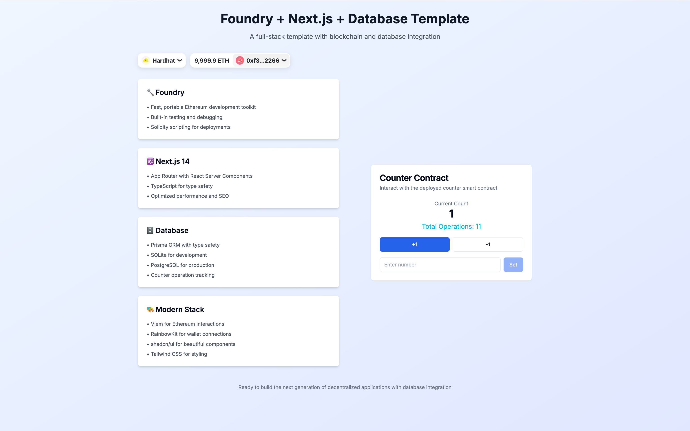

# Foundry + Next.js Template

📖 English | [🇨🇳 中文文档](README.zh-CN.md)

A lightweight, production-ready template for building decentralized applications with Foundry and Next.js.

## Features

- 🔧 **Foundry** - Fast, portable and modular toolkit for Ethereum development
- ⚛️ **Next.js 14** - React framework with App Router
- 🔗 **Viem** - TypeScript interface for Ethereum
- 🦄 **Wagmi** - React hooks for Ethereum
- 💳 **RainbowKit** - Best-in-class wallet connection
- 🎨 **shadcn/ui** - Beautiful and accessible UI components
- 🎯 **TypeScript** - Type safety across the stack
- 💅 **Tailwind CSS** - Utility-first CSS framework
- 📦 **pnpm** - Fast, disk space efficient package manager

## Prerequisites

- [Node.js](https://nodejs.org/) v18+ 
- [pnpm](https://pnpm.io/) v8+ (auto-installed if missing)
- [Foundry](https://getfoundry.sh/) - Install with `curl -L https://foundry.paradigm.xyz | bash && foundryup`

## Quick Start

```bash
# 1. Clone template
git clone <your-repo-url>
cd foundry-nextjs-template

# 2. Run setup (checks prerequisites, installs dependencies)
chmod +x setup.sh && ./setup.sh

# 3. Start local blockchain (Terminal 1)
anvil

# 4. Deploy contracts (Terminal 2)
forge script script/Deploy.s.sol --rpc-url http://localhost:8545 --private-key 0xac0974bec39a17e36ba4a6b4d238ff944bacb478cbed5efcae784d7bf4f2ff80 --broadcast

# 5. Update contract address in frontend/lib/contracts.ts with deployed address

# 6. Start frontend (Terminal 3)
cd frontend && pnpm dev
```

after that you'll see:



## Project Structure

```
├── contracts/          # Smart contracts
├── script/            # Deployment scripts  
├── test/              # Contract tests
├── frontend/          # Next.js application
│   ├── app/           # App router pages
│   ├── components/    # React components
│   ├── lib/           # Utilities and configurations
│   └── hooks/         # Custom React hooks
├── foundry.toml       # Foundry configuration
├── setup.sh           # Automated setup script
├── package.json       # Root package.json with pnpm scripts
├── README.md          # English documentation
└── README.zh-CN.md    # Chinese documentation
```

## Available Scripts

```bash
# Foundry
forge build           # Compile contracts
forge test            # Run tests
anvil                 # Start local node

# Frontend
pnpm dev              # Start development server
pnpm build            # Build for production
pnpm lint             # Run ESLint

# Root scripts
pnpm setup            # Install all dependencies
pnpm clean            # Clean build artifacts
```

## Development Workflow

1. **Smart Contracts** - Edit in `contracts/`, test with `forge test`
2. **Frontend** - React components in `frontend/components/`
3. **Configuration** - Update `frontend/lib/contracts.ts` after deployment
4. **Styling** - Use Tailwind classes and shadcn/ui components

## Adding UI Components

```bash
cd frontend
pnpm dlx shadcn-ui@latest add [component-name]
```

## Notes

- **Dependencies** - Foundry libs (`lib/`) and `.gitmodules` are auto-generated during setup
- **Environment** - Copy `frontend/.env.example` to `frontend/.env.local` for custom config
- **Deployment** - Update RPC URLs and private keys for different networks

## License

MIT
