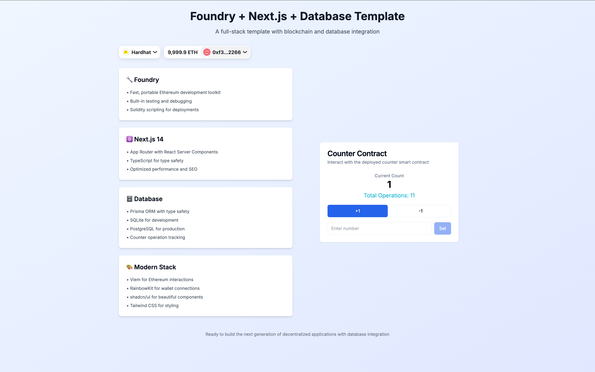

# Foundry + Next.js 模板

[📖 English README](README.md) | 🇨🇳 中文文档

一个轻量级、生产就绪的模板，用于构建基于 Foundry 和 Next.js 的去中心化应用程序。

## 特性

- 🔧 **Foundry** - 快速、便携、模块化的以太坊开发工具包
- ⚛️ **Next.js 14** - 带有 App Router 的 React 框架
- 🔗 **Viem** - TypeScript 以太坊接口
- 🦄 **Wagmi** - 以太坊 React Hooks
- 💳 **RainbowKit** - 顶级钱包连接组件
- 🎨 **shadcn/ui** - 美观且易用的 UI 组件库
- 🎯 **TypeScript** - 全栈类型安全
- 💅 **Tailwind CSS** - 实用优先的 CSS 框架
- 📦 **pnpm** - 快速、节省磁盘空间的包管理器

## 前置要求

- [Node.js](https://nodejs.org/) v18+ 
- [pnpm](https://pnpm.io/) v8+ (如果缺失会自动安装)
- [Foundry](https://getfoundry.sh/) - 使用 `curl -L https://foundry.paradigm.xyz | bash && foundryup` 安装

## 快速开始

```bash
# 1. 克隆模板
git clone <your-repo-url>
cd foundry-nextjs-template

# 2. 运行设置脚本 (检查前置条件，安装依赖)
chmod +x setup.sh && ./setup.sh

# 3. 启动本地区块链 (终端 1)
anvil

# 4. 部署合约 (终端 2)
forge script script/Deploy.s.sol --rpc-url http://localhost:8545 --private-key 0xac0974bec39a17e36ba4a6b4d238ff944bacb478cbed5efcae784d7bf4f2ff80 --broadcast

# 5. 在 frontend/lib/contracts.ts 中更新部署的合约地址

# 6. 启动前端 (终端 3)
cd frontend && pnpm dev
```

完成后你将看到：



## 项目结构

```
├── contracts/          # 智能合约
├── script/            # 部署脚本
├── test/              # 合约测试
├── frontend/          # Next.js 应用程序
│   ├── app/           # App router 页面
│   ├── components/    # React 组件
│   ├── lib/           # 工具和配置
│   └── hooks/         # 自定义 React hooks
├── foundry.toml       # Foundry 配置
├── setup.sh           # 自动化设置脚本
└── package.json       # 根目录 package.json 配置
```

## 可用脚本

```bash
# Foundry
forge build           # 编译合约
forge test            # 运行测试
anvil                 # 启动本地节点

# 前端
pnpm dev              # 启动开发服务器
pnpm build            # 构建生产版本
pnpm lint             # 运行 ESLint

# 根目录脚本
pnpm setup            # 安装所有依赖
pnpm clean            # 清理构建产物
```

## 开发工作流

1. **智能合约** - 在 `contracts/` 中编辑，使用 `forge test` 测试
2. **前端** - 在 `frontend/components/` 中编写 React 组件
3. **配置** - 部署后在 `frontend/lib/contracts.ts` 中更新配置
4. **样式** - 使用 Tailwind 类和 shadcn/ui 组件

## 添加 UI 组件

```bash
cd frontend
pnpm dlx shadcn-ui@latest add [组件名称]
```

## 注意事项

- **依赖管理** - Foundry 库 (`lib/`) 和 `.gitmodules` 在设置过程中自动生成
- **环境配置** - 复制 `frontend/.env.example` 到 `frontend/.env.local` 进行自定义配置
- **部署** - 针对不同网络更新 RPC URL 和私钥

## 钱包配置

### 添加 Anvil 测试网络到钱包

1. 打开你的钱包 (如 MetaMask)
2. 添加网络：
   - 网络名称: `Anvil`
   - RPC URL: `http://localhost:8545`
   - 链 ID: `31337`
   - 货币符号: `ETH`

3. 导入测试账户（使用 Anvil 提供的私钥之一）

### 获取 WalletConnect 项目 ID

1. 访问 [WalletConnect Cloud](https://cloud.walletconnect.com)
2. 创建新项目
3. 复制项目 ID 到 `frontend/.env.local`:
   ```
   NEXT_PUBLIC_WALLETCONNECT_PROJECT_ID=your_project_id_here
   ```

## 故障排除

### 常见问题

**"模块未找到" 错误**
```bash
cd frontend && pnpm install
```

**"合约未部署" 错误**
- 确保 Anvil 正在运行
- 确保合约已成功部署
- 检查 `frontend/lib/contracts.ts` 中的合约地址

**钱包连接问题**
- 确保已将 Anvil 网络添加到钱包
- 检查网络设置是否正确

**交易失败**
- 确保账户有测试 ETH
- 确保合约地址正确
- 检查交易参数

**pnpm 问题**
```bash
npm install -g pnpm
```

## 扩展功能

### 添加新的智能合约

1. 在 `contracts/` 中创建 `.sol` 文件
2. 更新 `script/Deploy.s.sol` 部署脚本
3. 在 `frontend/lib/contracts.ts` 中添加 ABI 和地址
4. 创建对应的 React 组件进行交互

### 部署到测试网

1. 获取测试网 RPC URL (如 Sepolia、Goerli)
2. 获取测试网 ETH
3. 更新部署脚本中的网络配置
4. 运行部署命令

### 自定义样式

- 编辑 `frontend/app/globals.css` 自定义 CSS 变量
- 使用 `frontend/tailwind.config.ts` 扩展 Tailwind 配置
- 在 `frontend/components/ui/` 中自定义组件样式

## 许可证

MIT
